# Project 4 - Trade Hub

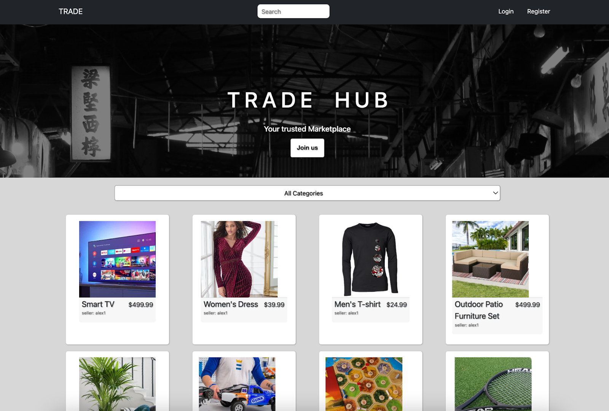

 
<h2>Description</h2>

For our final project of the Software Engineering Course at General Assembly, I decided to create a peer-to-peer marketplace with the name of “Trade Hub”. On this platform, users are able to register, login, buy and sell items as well as make use of a working pseudo-payment system. If the user is logged in, they can visit their profile page and view their purchases and listings, as well as deposit more credits. Unregistered users can browse through a list of items and visit an item’s specific page. 

 
<h2>Deployment link</h2>

This project was deployed with Heroku and can be found <a href="https://trade-hub-project.herokuapp.com/"> here</a>.

 
<h2>Getting Started/Code Installation</h2>

The code can be accessed through <a href="https://github.com/a-ullmann/trade-hub"> my GitHub page</a>.

 
<h2>Timeframe & Working Team</h2>

This solo project was to be completed within 7 working days.

 
<h2>Technologies Used</h2>

  <h4>Back End</h4>
<ul>
  <li>Python</li>
  <li>Django</li>
  <li>pylint</li>
  <li>autopep8</li>
  <li>Django Rest Framework</li>
  <li>JWT</li>
</ul>

  <h4>Front End</h4>
<ul>
  <li>JavaScript</li>
  <li>JSX (HTML5 with react)</li>
  <li>Axios</li>
  <li>Bootstrap</li>
  <li>Buffer</li>
  <li>React</li>
  <li>React-router-dom</li>
  <li>React-scripts</li>
  <li>Sass</li>
</ul>

  <h4>Other Tools</h4>
<ul>
  <li>Insomnia</li>
  <li>TablePlus</li>
  <li>Trello</li>
  <li>Excalidraw</li>
  <li>quickdatabasediagrams.com</li>
</ul>

 
<h2>Brief</h2>

<ul>
<li>Build a full-stack application by making your own backend and your own front-end.</li>
<li>Use a Python Django API using Django REST Framework to serve your data from a Postgres database.</li>
<li>Consume your API with a separate front-end built with React.</li>
<li>Be a complete product which most likely means multiple relationships and CRUD functionality for at least a couple of models.</li>
<li>Implement thoughtful user stories/wireframes that are significant enough to help you know which features are core MVP and which you can cut.</li>
<li>Have a visually impressive design to kick your portfolio up a notch and have something to wow future clients & employers.</li>
<li>Be deployed online so it's publicly accessible.</li>
</ul>

 
<h2>Planning</h2>

After careful consideration of what kind of project I wanted to create, I decided on a peer-to-peer marketplace. The inspiration came from an NFT-Marketplace, however due to the limited time and workforce, I decided to keep it simple and make a universal marketplace. The first step was to create a Wireframe on Excalidraw, allowing me to visualise my ideas. 

<h3>This wireframe shows three different pages as well as a nav-bar:</h3>
<h3>Nav-bar</h3>

The nav-bar would be always on top of every page for consistency. It will have a logo on the left with a redirect to the landing page when clicked on, a search bar to find items, a login and registration option if the user is not currently logged in, or a profile and logout option if they are. 

 
<h3>Item index page </h3>

This page will be the landing page. The thought process here was that if a new user visits my application, they would be directly exposed to all of the products they could potentially be interested in. In the best case, this would incentivise them to register in order to purchase their desired product. This page would also have a dropdown menu that would act as a filter for the ability to show the desired categories.

 
<h3>Single item page</h3>

This page would be accessed by clicking on an item from the index page. Here, the most important information of an item will be displayed, such as the name, picture, price and description. If the user decides to buy this item, they can use the “BUY NOW” button, which would open a confirmation box. 

 
<h3>Profile page </h3>

On this page users will find four different tabs, where they will be able to create a listing, view their listings as well as their purchased items, and deposit cash. 

 
<h4>Additional ideas that were not implemented due to limited time:</h4>

<ul>
  <li>A wish list or shopping cart system. With this, users would be able to track their desired purchases.</li>
  <li>A countdown timer on each item. This would serve as an additional incentive for users to complete the purchase as they would feel a time pressure. </li>
  <li>Subcategories. This would make it easier for users to find a product they are looking for once the database reaches a larger size. </li>
</ul>

I also set up a Trello board to keep track of any bugs I encountered during the coding process.

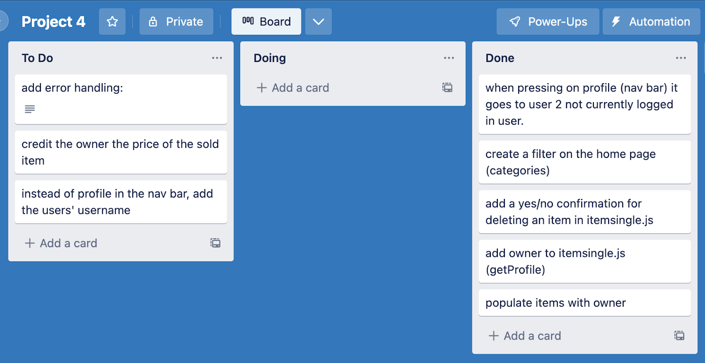

 
<h2>Build/Code Process</h2>

<h3>Back End:</h3>

Using the experience I gained from my previous projects in the software engineering course by General Assembly, my starting point was to set up the backend. For the first step, I visualised the relationships of my models I was going to have. To do this, I used quickdatabasediagrams.com as seen below:

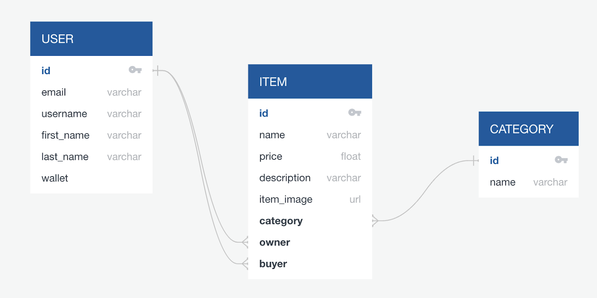

The user ID would have a one-to-many relationship with the owner and buyer of an item, as one user is able to own or buy mulitple items. An item has a many-to-one relationship with a category, as different items can have the same category.

 
<h4>User Model</h4>

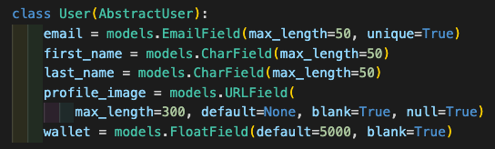

I extended Django’s Abstract User class to add additional fields.

 
<h4>Item Model</h4>

This model was the most elaborate one. The most interesting part of this model was the owner and buyer, as it would dictate on which list it would show. If the item was listed by a user, then the “owner” would be populated and it would show in the user’s profile tab. If another user were to buy this item, the “buyer” field would get populated and it would therefore show on the buyer’s purchase tab. This was filtered in an APIView as explained later in the build process.

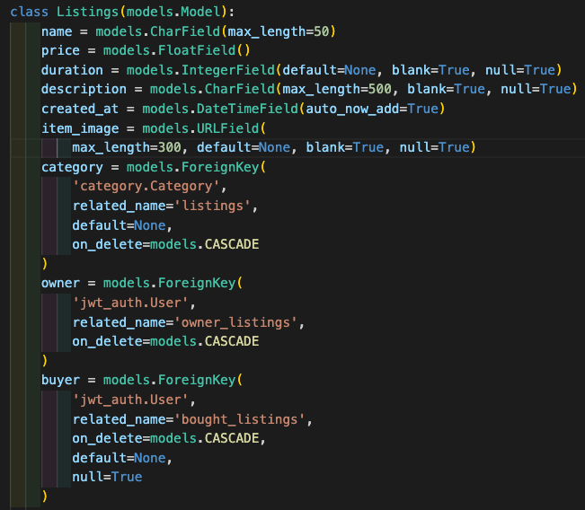

 
<h4>Category Model</h4>

This is a straight-forward model that would have a one-to-many relationship with items. 

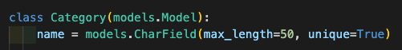

To implement CRUD functionality, various views were created for each model. A basic example would be an APIView from the items model. The following screenshot shows the get and post method for all items. 

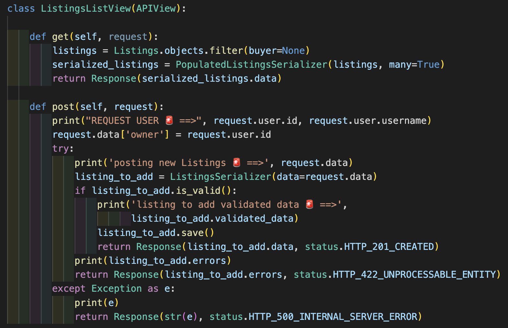

The GET method filters and only returns items that have no buyer. This results in showing only listed items on the homepage.

The post method, in this example, creates a new listing as it also populates the class with an ‘owner’ key. It then takes the ListingsSerializer and tries to add the requested data. Using Django’s .is_valid() function, it checks if the requested data matches the model and if it does, it saves it, else, it returns the errors and an HTTP status of 422 (unprocessable entity).

A more interesting example, as seen below, was creating different views for the user’s profile page. I initially struggled to filter the purchased and listed items in the front end, as I had done in previous projects, but doing this operation in the backend made much more sense. Not only does it feel simpler to implement, it also makes the API more scalable as it delivers only the necessary data to the frontend, resulting in faster loading times. 

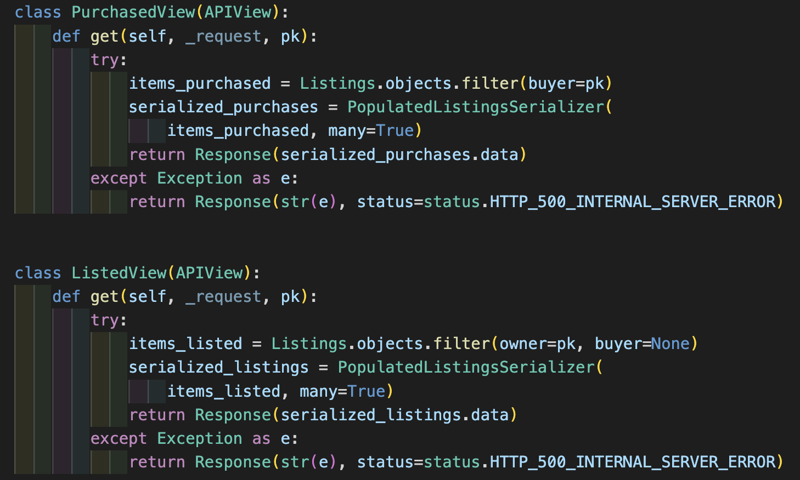

 
 
<h3>Front End:</h3>

The screenshot below shows the homepage of “Trade Hub”. It consists of a nav-bar, a hero section including a register button that only shows if the user is not logged in, and the main section containing the listed items, which can be filtered by category. These items show regardless of user authentication, letting also unregistered users view the products. 

 
<h4>Homepage</h4>

The data was fetched by using a GET-method with Axios, as seen by the useEffect function below:

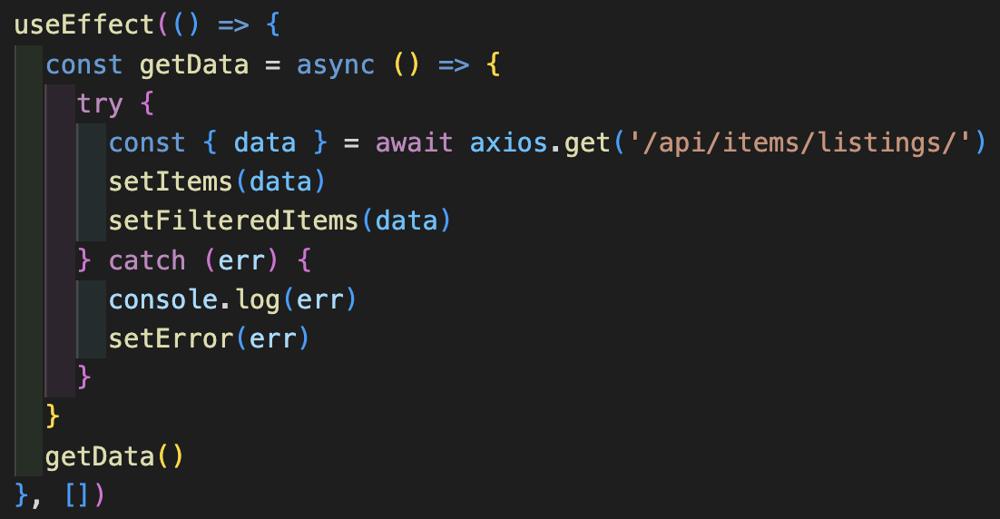

The component below would return the filteredItems (in this case, items that do not have a buyer), map them and, by using react-bootstrap, display each item as an individual card with the deconstructed data as seen here:

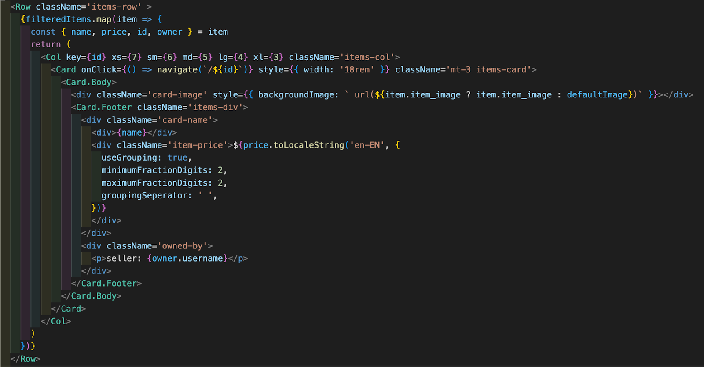

Every item that does not have an image provided when posted, a default image will be selected through a ternary statement. 

 
<h4>Single Item Page</h4>

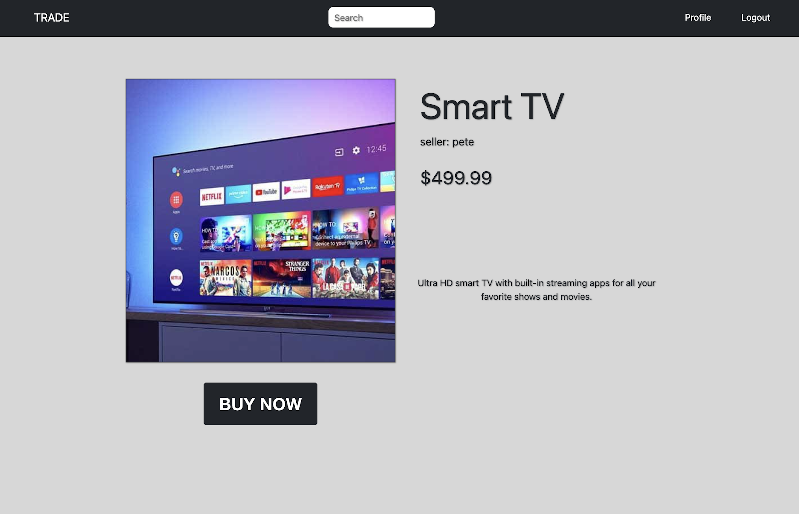

The screenshot above shows a single item’s page, showing various data of an item. If the user is logged in, they can use the “BUY NOW” button to open a confirmation box including a summary of their balance:

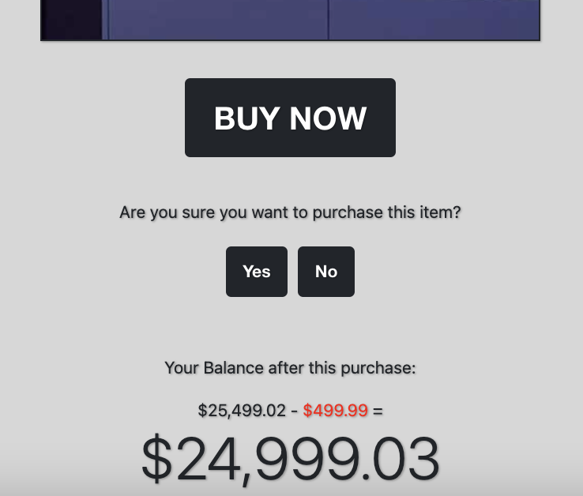

 
<h4>Profile Page</h4>

This page shows the individual user’s name as well as balance and four tabs, as can be seen below:

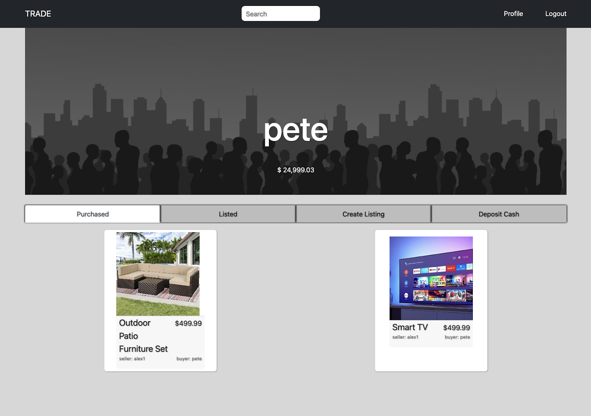

Once the user has purchased the item from the item page, it gets removed from the homepage and shows up in the “purchased” tab on the profile page. The tabs were created using React Bootstrap, as can be seen below.

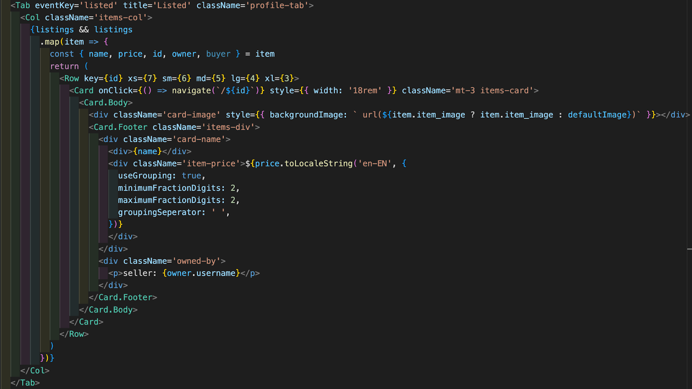

 
<h2>Challenges</h2>

Implementing all functionalities that were planned due to limited time. I initially planned to have a timer on each item that would allow the user to set a specific time for each listing. In theory, this sounded quick to implement, but I prioritised other functionality over this. Next time, I will make sure to keep my MVP as simple as possible with the necessary deliverables, and put the rest of my ambition towards stretch goals. 

Another challenge I came across was creating filters for the items. As I began this task, I was spending a lot of time trying to filter them in the front end, however, once I got the tip to try it in the back end, it clicked and I immediately saw the benefits of it. 

 
<h2>Wins</h2>

The biggest win I obtained from completing this project was a solid confidence boost as this was the first time I successfully created a full stack application by myself. I now have a thorough understanding of the fundamentals of a website with CRUD functionality. 

 
<h2>Key Learnings/Takeaways</h2>

The biggest takeaway I had from this project is that I now fully understand the general structure of Full-Stack applications. I really enjoyed using Python and Django REST Framework.

I also realised how I can reuse some of my code from previous projects and build on top of it. The ability to reuse previously written code leverages the possibilities of my future projects. 

Another key learning I had came from creating the profile page. Using React Bootstrap’s “Tabs” component made it intuitive to apply tabs to the page.  

 
<h2>Bugs</h2>

The first time a user is logged in, when pressing on the profile page, it displays the single item page with no data. The workaround for this bug is to refresh the index page a few times then try again.

 
<h2>Future Improvements</h2>

<ul>
  <li>Complete the pseudo-transactions by adding the amount of the purchased item to the original owner. </li>
  <li>Currently it only deducts the amount from the buyer.</li>
  <li>Make the app mobile friendly by making it responsive.</li>
  <li>Create better naming for models and elements.</li>
  <li>Error handling (especially on register page and listing an item).</li>
  <li>Implement a timer for listings.</li>
</ul>

